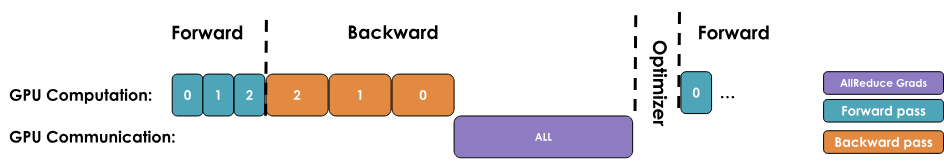
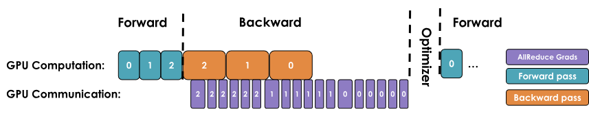
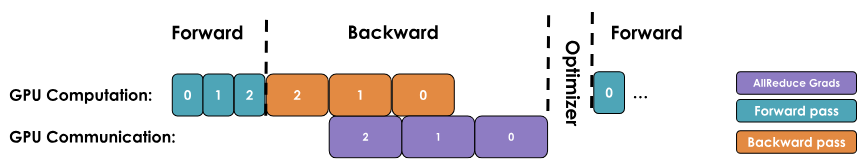
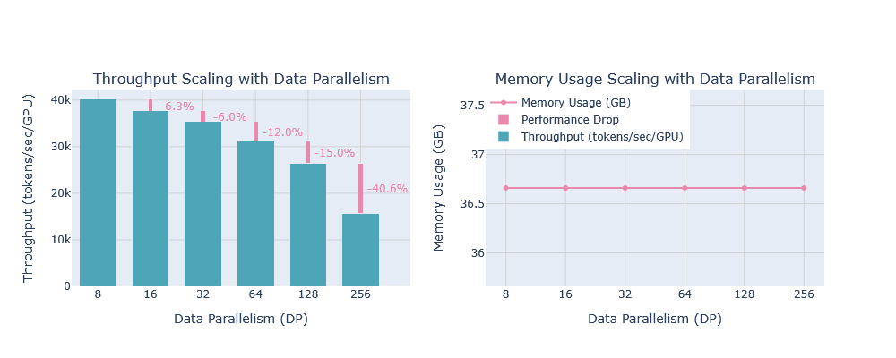
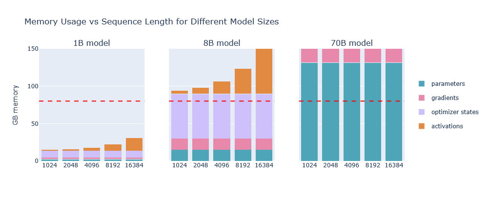
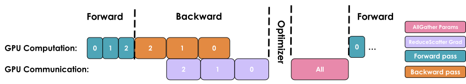

When training a neural network model, we store several items in memory:

- Model weights
- Model gradients
- Optimizer states
- Activations needed to compute the gradients

#### Memory for weights/grads/optimizer states

# Data Parallel approaches

##### 1) Vanilla approach, no overlapping of computation and communication, wait for entire backward pass to finish first then average gradients across nodes/gpus

##### 2) async reduce op : overlap, trigger average individually for each parameter as soon as that parameter is ready with gradient

##### 3) Bucket the gradients to improve utilization, call reduce/average op on each bucket

### Note: 

As we add more and more GPUs (hundreds or thousands), the overhead of  coordinating between them grows significantly, and the network  requirements start to become too large for the benefits. As a result,  our setup will become less and less efficient with each additional GPU  we add to the system.

#### Data Parallel performance limits

This assumes that we can fit at least one input sample forward pass (mbs=1) into GPU memory. This is not always the case! As we can see, larger  models often don’t fit into a single GPU, even with activation  recomputation enabled.

We've also seen that data parallelism starts to have some limiting communication overhead above a certain level of scaling.

#### There are two main approaches to splitting: parallelism (tensor,  context, or pipeline parallelism) and sharding (DeepSpeed ZeRO or  PyTorch FSDP)

### Zero Redundancy Optimizer (ZeRO)

>  a memory optimization technology designed to reduce memory redundancy in LLM training.

1. While data parallelism is an efficient way to scale training, the naive  replication of optimizer states, gradients, and parameters across each  DP rank introduces significant memory redundancy. 
2. ZeRO eliminates this by partitioning the optimizer states, gradients,  and parameters across the data parallel dimension, while still allowing  computation with the full set of parameters. 
3.  This sometimes requires more communications between DP ranks, which may or may not be fully overlapped

This approach is organized into three possible optimization stages:

1. ZeRO-1: optimizer state partitioning
2. ZeRO-2: optimizer state + gradient partitioning
3. ZeRO-3: optimizer state + gradient + parameter partitioning

> Note: Since each DP replica of the model receives a different micro-batch, the activations on each DP rank also differ, so they are not duplicated and thus can’t be sharded, hence not mentioned in above list of possible partitions.

1. The idea of **ZeRO** is to **shard** these objects across Data Parallel ranks and *each node only stores a slice of these*.

2. These slices are then reconstructed when needed, hence reducing/dividing memory by data parallel factor Nd

### ZeRO-1: Partitioning optimizer states

1. In vanilla DP, all ranks gather the same gradients after the backward pass and simultaneously perform identical optimizer steps
2. In this, the optimizer states are divided into Nd parts equally.
3. Each model replicas distributed over Nd ranks keeps track only 1/Nd optimizer states and during optimization only 1/Nd fp32 weights are updated.
4. However, during the forward pass, each replica needs all the parameters. We thus need to add an additional ***all-gather\***
5.  the sequence of operations for a single training step:
   1. Perform a forward pass with the same full set of BF16 parameters on each replica, but different micro-batches across replicas.
   2. Perform a backward pass with the same full set of gradients on each replica, but different micro-batches across replicas.
   3. Perform a ***reduce-scatter\*** on the gradients 
   4. Each replica performs an optimizer step on its local optimizer states (only 1/N_d of the optimizer states) to get  1/N_d updated FP32 parameters, which can then be converted to 1/N_d of the full set of BF16 parameters.
   5. Perform an all-gather on the BF16 parameters to send the missing slices  back to each replica. This is a new operation in ZeRO and is not used in vanilla DP.

6. In terms of practical communications, compared to vanilla DP, ZeRO-1  changes our all-reduce gradient communication to a reduce-scatter  operation and adds an all-gather operation over all parameters after the optimizer step

Note: during the forward pass, each replica needs all the parameters. We thus need to add an additional ***all-gather\*** after the optimizer step so that each model replica has  the full set of updated weights.
